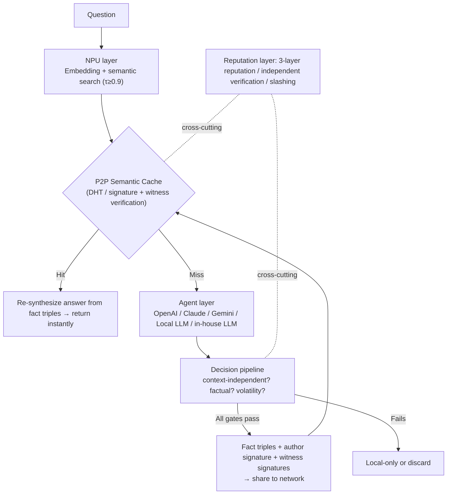

# NyLLM — Winny-style Semantic Cache

**English** | [日本語](./README.md)

> **Don't make the AI think every time. First, search for the answer humanity already gave.**

The same questions get thrown at LLMs all over the world, and every time a GPU re-runs inference to answer them. This project cuts that waste with a simple shape: **semantic-search a distributed cache first, and only run inference on a miss.** The cache is shared across users at human scale over a Winny-style P2P network.

`Semantic Cache` `P2P / DHT` `NPU-first` `Local First AI` `Distributed Knowledge` `Sybil-resistant Reputation`

**Status: 🚧 Design phase complete / PoC S1 (single-node minimal loop) and S2 (judgment pipeline) complete, S3 (P2P) not yet started** — there is no live network yet. No overselling.

---

## Table of Contents

- [Why build this](#why-build-this)
- [What's new](#whats-new)
- [How it works](#how-it-works)
- [Design edges](#design-edges)
- [Physical network separation](#physical-network-separation)
- [Roadmap](#roadmap)
- [Documentation](#documentation)

---

## Why build this

Every day, all over the world, **nearly identical questions** are sent to LLMs, and a GPU redoes the inference each time.

- "What is Winny?" / "Winny, what's that?" / "Tell me about the P2P software Winny" — same meaning, three inferences.
- That accumulation burns as GPU time, electricity, latency, and API cost on a global scale.

A question whose answer already exists needs no inference. What it needs is **a cache you can query by meaning**, and **a way for everyone to share it.**

```text
Traditional:  question → inference every time → answer
Proposed:     question → semantic search → return instantly on Hit / infer and share only on Miss
```

## What's new

Semantic caching itself is existing technology (GPTCache, Redis Semantic Cache). However:

| | GPTCache | MeanCache | **This project** |
|---|---|---|---|
| Cache location | In app / server | Local to each user's device | **P2P distributed sharing** |
| Sharing scope | Within a single system | Fully private (no sharing) | **Cross-user, human scale** |
| Privacy | — | Protected via federated learning | **Physical network separation** (Public/Company/Private) |
| Trust of shared cache | Out of scope | Out of scope (since nothing is shared) | **The core problem. Designed with 3-layer reputation + independent verification** |

In other words, **"a semantic cache shared across users" is an empty space** in the landscape, and the invention of this project is solving — without a central authority — the trust problems that inevitably arise there (cache poisoning, Sybil attacks, freshness, forgery, legal risk).

## How it works



- **Read (hot path)**: every query. Lightweight — just looks up precomputed trust aggregates.
- **Write (cold path)**: only on a miss. Full evaluation, triple decomposition, and signing are concentrated here.

## Design edges

- 🎯 **Only "context-independent × factual" content is shared** — "Change the color to red" (context-dependent), "the latest ~" (time-sensitive), and "what do you recommend?" (subjective) are not shared. The default is *not shared*; an entry is promoted only when all gates pass. In a human-scale cache, false positives (pollution) are far more harmful than false negatives — hence a precision-first design.
- ⚡ **The NPU does semantic search; the GPU only handles the unknown** — embedding generation, similarity, and classification run on the NPU (MPNet-class 768-dim → PCA-compressed to 64-dim). Inference is delegated to an Agent only on a miss. The network itself never infers.
- 🛡️ **Truth is not decided by voting — Sybil resistance via 3-layer reputation** — the primary mechanism is the fact-triple agreement rate across independently generated answers (Sybil-independent). Node reputation uses local EigenTrust + birth certificates + proof-of-work on ID creation, imposing "time" — a non-parallelizable cost — on mass ID creation. If poisoning is exposed, reputation is burned (slashing). Even high-trust cache entries keep a probabilistic surprise re-inference.
- 📜 **Store only fact triples — keep legal distance structurally** — no long-form or verbatim text is stored. Only fact triples like `(Winny, developer, Isamu Kaneko)` plus provenance metadata are stored; the answer is re-synthesized on the receiving side each time. A regurgitation filter rejects registration of verbatim reproductions of existing copyrighted works, and signed revocation records enable takedown without a central authority. **The selling point is not anonymity but explainability** — every entry records who generated it, when, and with which model. (This is not legal advice; expert review is assumed before opening the Public layer.)
- 🔒 **Privacy comes from physical separation, not AI judgment** — see below.

## Physical network separation

Rather than "the AI judges well and protects you," **the network you join is itself separated.** The mode is selected at startup, with separate icons, so a misclick can't leak secrets into Public.

| Mode | Scope | Use | Launch |
|---|---|---|---|
| 🌍 Public | Shared with everyone | General knowledge, OSS, public info | `ai-node --mode public` |
| 🏢 Company | Internal only | Internal FAQ, knowledge, RAG | `ai-node --mode company` |
| 🔐 Private | Fully local | Personal notes, confidential | `ai-node --mode private` |

## Roadmap

The authoritative source for stage definitions, gates, and measured results is [docs/Roadmap.md](./docs/Roadmap.md) (Japanese). Summary below.

| Stage | Content | Status |
|---|---|---|
| S1 | PoC minimal loop (embedding search → Agent on miss → signed registration, single node) | ✅ Done |
| S2 | Decision pipeline (L0/L2 gates + triple decomposition + volatility tags) | ✅ Done |
| S3 | P2P (DHT, witness signatures, multi-version coexistence) | ⬜ |
| S4 | Reputation & independent verification (3-layer reputation, slashing, surprise verification) | ⬜ |
| S5 | Legal mechanisms (regurgitation filter, revocation, provenance records) | ⬜ |
| S6 | Mode separation + UI | ⬜ |
| S7 | Limited launch of Public layer (invite-only, after expert review) | ⬜ |

## Documentation

The full design lives here. This README is only the entrance. (The design documents are written in Japanese.)

- 📐 [Architecture design](./docs/Winny_Type_Semantic_Cache_Architecture.md) — the clean implementation spec. **Start here.**
- 💡 [Original concept](./docs/Winny_Type_Semantic_Cache_AI_Concept.md) — philosophy and prototype
- 🔍 [Competitive analysis & reliability design notes](./docs/Winny_Type_Semantic_Cache_信頼性設計メモ.md) — GPTCache/MeanCache comparison, threat model, derivation of Sybil defenses

## About the name

"Winny-style" is a **conceptual homage to a distributed-sharing architecture with no central authority.** This project takes the lessons of Winny — the consequences of undeletable content, anonymity, and indiscriminate sharing — head-on as design requirements, reconstructing it as a network that is *deletable, traceable, and shares only factual information.*

## Contributing

Since this is the design phase, discussion via Issues/Discussions is welcome first. Welcome themes, development environment, coding conventions, and the invariants to read before touching anything are all collected in the **[Contributing Guide](./CONTRIBUTING.en.md)**.

> Before sending code, agreement to [CLA.md](./CLA.md) is required. This is what makes the future license migration (below) possible.

## License

Currently **[GNU AGPL-3.0](./LICENSE)**.

A copyleft that treats network use as distribution, preventing this knowledge commons from being enclosed as a proprietary SaaS by any single vendor (faithful to the project's philosophy).

**Future plan**: once the project is sufficiently mature, migration to the more permissive **Apache-2.0** (with patent grant) is planned, to maximize network effects and encourage broad adoption including internal corporate use (Company mode). To make this migration possible, all contributors are asked to agree to [CLA.md](./CLA.md).

> Note: statements about licensing are not legal advice.
