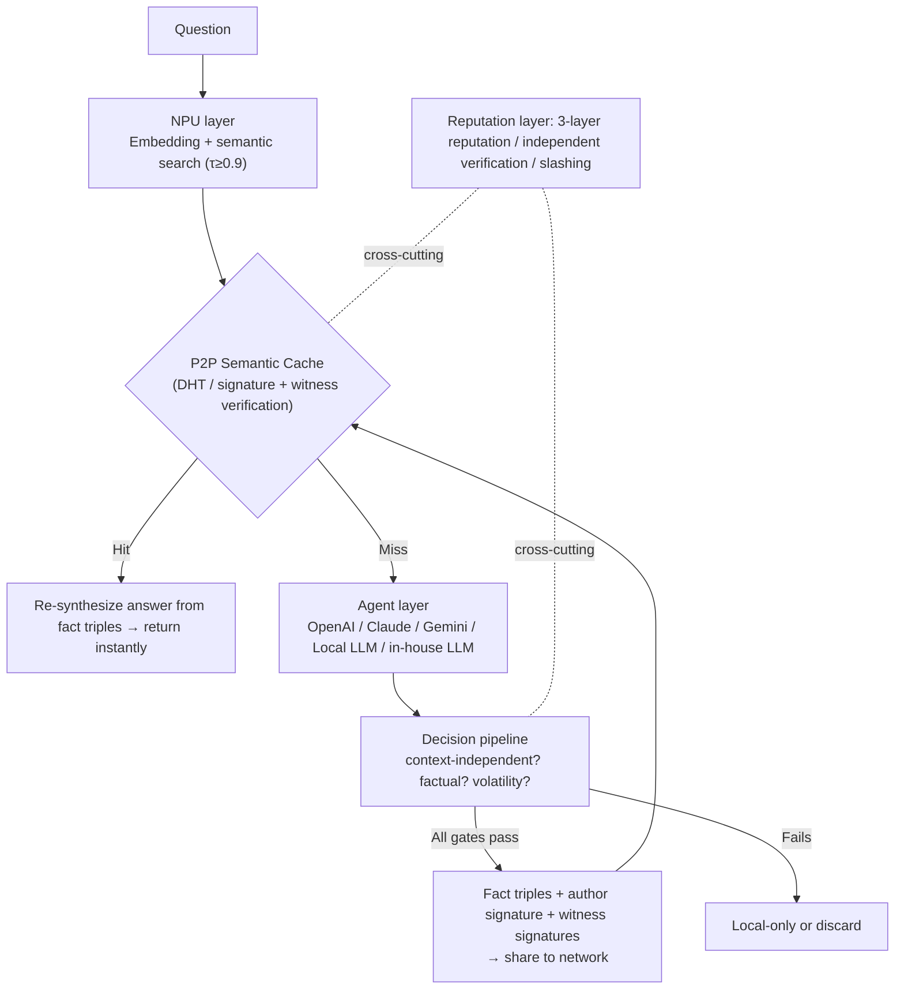

# NyLLM — Distributed Semantic Cache, and a Trust Layer for Shared Knowledge

**English** | [日本語](./README.md)

> **An answer, once given, is never computed twice — and never trusted until it is verified.**

The same questions get thrown at LLMs all over the world, and every time a GPU re-runs inference to answer them. This project cuts that waste with a simple shape: **semantic-search a distributed cache first, and only run inference on a miss.** The main battleground is first **within an organization (the Company layer)** — internal knowledge sharing and reducing inference inside an org — where the reliability design is established first. Sharing across users at human scale (the Public layer) is a conditional, later phase, gated on a transition to be reached only once specific conditions are met.

`Semantic Cache` `P2P / DHT` `NPU-first` `Local First AI` `Distributed Knowledge` `Sybil-resistant Reputation`

**Status: 🚧 Design phase complete / S1 (single-node minimal loop), S2 (judgment pipeline), and S3 (multi-node sharing = reduced Company-Phase1 scope) complete** — there is no public live network yet. No overselling.

---

## Table of Contents

- [Why build this](#why-build-this)
- [What's new](#whats-new)
- [How it works](#how-it-works)
- [Design edges](#design-edges)
- [Physical network separation](#physical-network-separation)
- [Roadmap](#roadmap)
- [Documentation](#documentation)

---

## Why build this

Every day, all over the world, **nearly identical questions** are sent to LLMs, and a GPU redoes the inference each time.

- "What is Winny?" / "Winny, what's that?" / "Tell me about the P2P software Winny" — same meaning, three inferences.
- That accumulation burns as GPU time, electricity, latency, and API cost on a global scale.

A question whose answer already exists needs no inference. What it needs is **a cache you can query by meaning**, and **a way to share it first within a team or organization** (sharing at human scale is a later phase we keep in view further down the road).

```text
Traditional:  question → inference every time → answer
Proposed:     question → semantic search → return instantly on Hit / infer and share only on Miss
```

## What's new

Semantic caching itself is existing technology (GPTCache, Redis LangCache). **Even sharing already exists** — but at the token level, and at the cost of a side channel that leaks other users' prompts through response-time differences (Stanford, 2025). The empty space is the three-way combination: sharing *semantic answers*, *across users and organizations*, *with a trust layer that withstands poisoning*. In 2026, poisoning of semantic caches was demonstrated as a real attack, and existing defenses were shown unable to fully stop it (NDSS 2026). In other words, the trust layer this project puts at its core (3-layer reputation, independent verification, the share gate) is not a nice-to-have — it is the precondition for sharing to work at all.

| | GPTCache | MeanCache | **This project** |
|---|---|---|---|
| Cache location | In app / server | Local to each user's device | **P2P distributed sharing** |
| Sharing scope | Within a single system | Fully private (no sharing) | **Internal to an organization (Company layer, Phase1) → eventually cross-user, human scale (Public layer, Phase2, conditional)** |
| Privacy | — | Protected via federated learning | **Physical network separation** (Public/Company/Private) |
| Trust of shared cache | Out of scope | Out of scope (since nothing is shared) | **The core problem. Designed with 3-layer reputation + independent verification** |

In other words, the empty space is "a semantic cache that is shared" itself. But if the sharing scope is unconditionally widened to cross-user, human scale, the trust problems that inevitably arise there (cache poisoning, Sybil attacks, freshness, forgery, legal risk, incentive design) are maximized. This concern is not hypothetical: poisoning of semantic caches is a demonstrated threat, and existing defenses have been shown unable to fully stop it (NDSS 2026). Token-level cross-user caching does exist commercially, but it has been shown to carry the cost of a side channel — other users' prompts can be inferred from response-time differences (Stanford, ICML 2025) — which is also part of the evidence behind this project's physical network separation. Almost all of this difficulty stems from participants being able to join "permissionlessly" and being an "anonymous many." **The organizational (Company) layer removes both of those conditions**, giving a realistic scope where value and shareability genuinely intersect and where these difficulties are structurally far less likely to arise. This project aims to make the loop work first within the Company layer, then — building on the reliability design established there (3-layer reputation, independent verification, the share gate) — conditionally extend to the Public layer (human-scale sharing) as Phase2, once the transition gate is met.

## How it works



- **Read (hot path)**: every query. Lightweight — just looks up precomputed trust aggregates.
- **Write (cold path)**: only on a miss. Full evaluation, triple decomposition, and signing are concentrated here.
- **The inference backend is swappable**: the Agent used on a miss is selectable via configuration, and an Ollama-based local inference path is already implemented in `src/core` (mock by default; a local LLM can be plugged in with no external API key).

## Design edges

- 🎯 **Only "context-independent × factual" content is shared** — "Change the color to red" (context-dependent), "the latest ~" (time-sensitive), and "what do you recommend?" (subjective) are not shared. The default is *not shared*; an entry is promoted only when all gates pass. In a shared cache, false positives (pollution) are far more harmful than false negatives — hence a precision-first design (the same principle applies at both organizational-sharing and future Public-layer scale).
- ⚡ **The NPU does semantic search; the GPU only handles the unknown** — embedding generation, similarity, and classification run on the NPU (MPNet-class 768-dim → PCA-compressed to 64-dim). Inference is delegated to an Agent only on a miss. The network itself never infers.
- 🛡️ **Truth is not decided by voting — Sybil resistance via 3-layer reputation** — the primary mechanism is the fact-triple agreement rate across independently generated answers (Sybil-independent). Node reputation uses local EigenTrust + birth certificates + proof-of-work on ID creation, imposing "time" — a non-parallelizable cost — on mass ID creation. If poisoning is exposed, reputation is burned (slashing). Even high-trust cache entries keep a probabilistic surprise re-inference.
- 📜 **Store only fact triples — keep legal distance structurally** — no long-form or verbatim text is stored. Only fact triples like `(Winny, developer, Isamu Kaneko)` plus provenance metadata are stored; the answer is re-synthesized on the receiving side each time. A regurgitation filter rejects registration of verbatim reproductions of existing copyrighted works, and signed revocation records enable takedown without a central authority. **The selling point is not anonymity but explainability** — every entry records who generated it, when, and with which model. (This is not legal advice; expert review is assumed before opening the Public layer.)
- 🔒 **Privacy comes from physical separation, not AI judgment** — see below.

## Physical network separation

Rather than "the AI judges well and protects you," **the network you join is itself separated.** The mode is selected at startup, with separate icons, so a misclick can't leak secrets into Public.

| Mode | Scope | Use | Launch |
|---|---|---|---|
| 🌍 Public | Shared with everyone | General knowledge, OSS, public info | `ai-node --mode public` |
| 🏢 Company | Internal only | Internal FAQ, knowledge, RAG | `ai-node --mode company` |
| 🔐 Private | Fully local | Personal notes, confidential | `ai-node --mode private` |

## Roadmap

The authoritative source for stage definitions, gates, and measured results is [docs/Roadmap.md](./docs/Roadmap.md) (Japanese). Summary below.

| Stage | Content | Status |
|---|---|---|
| S1 | PoC minimal loop (embedding search → Agent on miss → signed registration, single node) | ✅ Done |
| S2 | Decision pipeline (L0/L2 gates + triple decomposition + volatility tags) | ✅ Done |
| S3 | P2P (DHT, witness signatures, multi-version coexistence) | ✅ Done (reduced Company-Phase1 scope; full P2P — DHT and witness — is re-expanded in Public Phase2) |
| S4 | Reputation & independent verification (3-layer reputation, slashing, surprise verification) | ⬜ |
| S5 | Legal mechanisms (regurgitation filter, revocation, provenance records) | ⬜ |
| S6 | Mode separation + UI | ⬜ |
| S7 | Limited launch of Public layer (invite-only, after expert review) | ⬜ |

The definitions and gates of S1–S7 above are unchanged; a **staged rollout of the main battleground (Company Phase1 → Public Phase2)** is layered on top of them. The Company layer (internal to an organization) is implemented first as Phase1: S3–S6 are reduced to an "internal-only" version under Phase1, while S4's reputation system, S5's full legal mechanisms, and S7's limited Public launch are deferred to Phase2. The move to Phase2 only starts once transition-gate conditions are met (e.g. the invariant core is stable, the share-gate pass rate has been measured internally). See [docs/Roadmap.md](./docs/Roadmap.md) §0 (staged rollout) for details.

## Documentation

The full design lives here. This README is only the entrance. (The design documents are written in Japanese.)

- 📐 [Architecture design](./docs/Architecture.md) — the clean implementation spec. **Start here.**
- 💡 [Original concept](./docs/AI_Concept.md) — philosophy and prototype
- 🔍 [Competitive analysis & reliability design notes](./docs/信頼性設計メモ.md) — GPTCache/MeanCache comparison, threat model, derivation of Sybil defenses
- 🗺️ [Roadmap](./docs/Roadmap.md) — the authoritative source for stage (S1–S7) definitions, gates, and progress. §0 records the staged rollout of the main battleground (Company Phase1 → Public Phase2; the adoption rationale can be traced from that section to the design review record)

## Design philosophy

Some decentralized sharing networks with no central authority have, historically, arrived at the consequences of undeletable content, anonymity, and indiscriminate sharing. This project takes those lessons as a cautionary tale and inverts them into design principles: content that is **deletable (revocable), traceable (signed, non-anonymous), and shares only factual information (via the share gate).**

## Contributing

Since this is the design phase, discussion via Issues/Discussions is welcome first. Welcome themes, development environment, coding conventions, and the invariants to read before touching anything are all collected in the **[Contributing Guide](./CONTRIBUTING.en.md)**.

> Before sending code, agreement to [CLA.md](./CLA.md) is required. This is what makes the future license migration (below) possible.

## License

Currently **[GNU AGPL-3.0](./LICENSE)**.

A copyleft that treats network use as distribution, preventing this knowledge commons from being enclosed as a proprietary SaaS by any single vendor (faithful to the project's philosophy).

**Future plan**: once the project is sufficiently mature, migration to the more permissive **Apache-2.0** (with patent grant) is planned, to maximize network effects and encourage broad adoption including internal corporate use (Company mode). To make this migration possible, all contributors are asked to agree to [CLA.md](./CLA.md).

> Note: statements about licensing are not legal advice.
