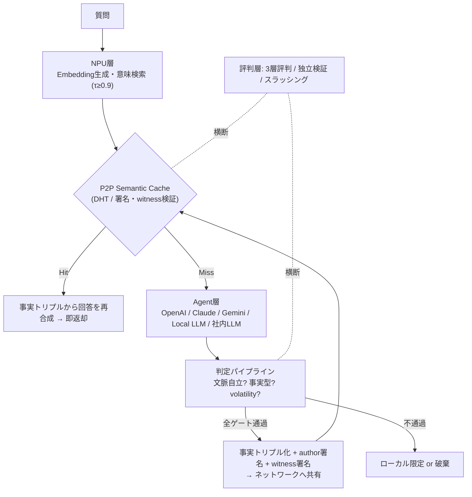

# NyLLM — 分散セマンティックキャッシュ

[English](./README.en.md) | **日本語**

> **AIに毎回考えさせるな。人類が一度出した答えを、まず探せ。**

同種の質問にLLMが毎回GPUを回して推論する——その無駄を、**「まず分散キャッシュを意味検索し、ミスしたときだけ推論する」** 構成で削る。主戦場はまず**組織内(Company層)**——社内ナレッジ共有・組織内の推論削減——に置き、そこで信頼性設計を確立したうえで、ユーザー横断・人類規模の共有(Public層)は移行ゲートを満たした将来フェーズとして条件付きで後続させる段階展開を採る。

`Semantic Cache` `P2P / DHT` `NPU-first` `Local First AI` `Distributed Knowledge` `Sybil-resistant Reputation`

**Status: 🚧 設計フェーズ完了 / S1(単一ノード最小ループ)・S2(判定パイプライン)・S3(多ノード共有=Company Phase1縮約範囲)完了** — 公開の稼働ネットワークはまだありません。誇大広告なし。

---

## 目次

- [なぜ作るのか](#なぜ作るのか)
- [何が新しいのか](#何が新しいのか)
- [仕組み](#仕組み)
- [設計上の尖り](#設計上の尖り)
- [ネットワークの物理分離](#ネットワークの物理分離)
- [ロードマップ](#ロードマップ)
- [ドキュメント](#ドキュメント)

---

## なぜ作るのか

世界中で毎日、**ほぼ同じ質問**がLLMに投げられ、そのたびにGPUが推論をやり直している。

- 「Winnyとは？」「Winnyって何？」「P2PソフトWinnyについて教えて」——意味は同じ、推論は3回。
- その積み重ねが、GPU時間・電力・レイテンシ・APIコストとして世界規模で燃えている。

答えが既に存在する質問に、推論は要らない。必要なのは**意味で引けるキャッシュ**と、それを**まずはチーム・組織の中で共有する仕組み**だ(人類規模での共有は、その先にある将来フェーズとして見据える)。

```text
従来:  質問 → 毎回推論 → 回答
提案:  質問 → 意味検索 → Hit なら即返却 / Miss のときだけ推論して共有
```

## 何が新しいのか

Semantic Cache自体は既存技術です(GPTCache, Redis Semantic Cache)。ただし:

| | GPTCache | MeanCache | **本構想** |
|---|---|---|---|
| キャッシュ所在 | アプリ/サーバ内 | 各ユーザー端末ローカル | **P2P分散共有** |
| 共有範囲 | 単一システム内 | 完全プライベート(共有なし) | **組織内共有(Company層、Phase1)→ 将来的にユーザー横断・人類規模(Public層、Phase2条件付き)** |
| プライバシー | — | 連合学習で守る | **ネットワーク物理分離** (Public/Company/Private) |
| 共有キャッシュの信頼性 | 対象外 | 対象外(共有しないため) | **本丸。3層評判+独立検証で設計** |

つまり空白地帯は「共有される意味キャッシュ」そのものです。ただし共有範囲を無条件にユーザー横断・人類規模へ広げると、そこで必然的に発生する信頼性問題(キャッシュ毒・シビル攻撃・鮮度・詐称・法的リスク・インセンティブ設計)が最大化されます。参加者が「誰でも参加できる・匿名多数」であることがこの困難のほぼ全ての根です。**組織内(Company層)はこの2条件を両方消せる**ため、価値と共有可能性の積集合が実在し、上記の困難が構造的に生じにくい現実的なスコープです。本プロジェクトはまずCompany層でこの構成を成立させ、そこで確立した信頼性設計(3層評判・独立検証・共有ゲート)を土台に、Public層(人類規模共有)へは移行ゲートを満たした場合にPhase2として条件付きで拡張することを目指します。

## 仕組み



- **読み取り (hot path)**: 毎クエリ。計算済みの信頼度集計を引くだけで軽量。
- **書き込み (cold path)**: ミス時のみ。フル判定・トリプル分解・署名はここに集約。
- **推論先は差し替え可能**: ミス時のAgent(推論先)は設定で選択でき、Ollamaベースのローカル推論経路を `src/core` に実装済み(既定はモック。ローカルLLMは外部APIキー不要で差し込める)。

## 設計上の尖り

- 🎯 **共有するのは「文脈自立 × 事実型」だけ** — 「色を赤に変えて」(文脈依存)や「最新の〜」(時事)、「おすすめは？」(主観)は共有しない。デフォルトは非共有、全ゲート通過時のみ昇格。共有キャッシュでは偽陽性(汚染)が偽陰性より遥かに有害、という精度優先の設計(組織内共有・将来のPublic層いずれの規模でも同じ原則)。
- ⚡ **NPUが意味検索、GPUは未知問題だけ** — Embedding生成・類似度判定・分類はNPU (MPNet級 768次元 → PCA 64次元圧縮)。推論はミス時のみAgentへ委譲。ネットワーク自体は一切推論しない。
- 🛡️ **投票で真偽を決めない — 3層評判でシビル耐性** — 主軸は「独立生成された複数回答の事実トリプル一致率」(シビル非依存)。ノード評判は局所EigenTrust+誕生証明+ID生成PoWで、新規大量IDに「時間」という並列化不可能なコストを課す。毒注入が露見すれば評判は焼失(スラッシング)。高信頼キャッシュにも確率的な抜き打ち再推論を残す。
- 📜 **事実トリプルのみ保存 — 法的距離を構造で取る** — 長文・逐語表現は保存しない。保存するのは `(Winny, 開発者, 金子勇)` のような事実トリプル+出典メタのみで、回答は受信側で毎回再合成。regurgitationフィルタで既存著作物の逐語再現を登録拒否し、署名付き失効通知(revocation)で中央なしにテイクダウン可能。**売りは匿名性ではなく説明可能性** — 誰が・いつ・どのモデルで生成したかを全エントリに記録する。(※法的助言ではありません。Public層公開前に専門家レビューを前提としています)
- 🔒 **プライバシーはAI判定でなく物理分離** — 後述。

## ネットワークの物理分離

「AIがうまく判定して守る」のではなく、**参加するネットワーク自体を分ける**。モードは起動時選択で、アイコンも分離。誤操作で機密がPublicへ漏れない構造。

| モード | 範囲 | 用途 | 起動 |
|---|---|---|---|
| 🌍 Public | 全体共有 | 一般知識・OSS・公開情報 | `ai-node --mode public` |
| 🏢 Company | 社内限定 | 社内FAQ・ナレッジ・RAG | `ai-node --mode company` |
| 🔐 Private | 完全ローカル | 個人メモ・機密 | `ai-node --mode private` |

## ロードマップ

詳細な段階定義・ゲート・実測値は [docs/Roadmap.md](./docs/Roadmap.md) が一次情報です。以下は要約。

| 段階 | 内容 | 状態 |
|---|---|---|
| S1 | PoC最小ループ (Embedding検索→ミス時Agent→署名付き登録、単一ノード) | ✅ 完了 |
| S2 | 判定パイプライン (L0/L2ゲート+トリプル分解+揮発性タグ) | ✅ 完了 |
| S3 | P2P化 (DHT・witness署名・複数版併存) | ✅ 完了(Company Phase1縮約範囲。フルP2P〔DHT・witness〕はPublic Phase2で再拡張) |
| S4 | 評判・独立検証 (3層評判・スラッシング・抜き打ち検証) | ⬜ |
| S5 | 法的機構 (regurgitationフィルタ・revocation・出所記録) | ⬜ |
| S6 | モード分離+UI | ⬜ |
| S7 | Public層の限定公開 (招待制・専門家レビュー後) | ⬜ |

上記S1〜S7自体の定義・ゲートは変えず、その上に**主戦場の段階展開(Company Phase1 → Public Phase2)** が重なります。Company層(組織内)をPhase1として先行実装し、S3〜S6はPhase1では"社内版"に縮約、S4の評判・S5の法的機構フル実装・S7のPublic限定公開はPhase2に繰り延べます。Phase2への移行は「不変コア安定」「共有ゲート通過率の社内実測」などの移行ゲートを満たした場合のみ着手します。詳細は [docs/Roadmap.md](./docs/Roadmap.md) §0(段階展開)を参照。

## ドキュメント

設計の全容はこちら。READMEは入口にすぎません。

- 📐 [アーキテクチャ設計書](./docs/Architecture.md) — 実装仕様の清書版。**まずこれ**
- 💡 [元コンセプト](./docs/AI_Concept.md) — 思想と原型
- 🔍 [競合分析 & 信頼性設計メモ](./docs/信頼性設計メモ.md) — GPTCache/MeanCache比較、脅威モデル、シビル対策の導出過程
- 🗺️ [ロードマップ](./docs/Roadmap.md) — 段階(S1〜S7)の定義・ゲート・進捗の一次情報。§0に主戦場の段階展開(Company Phase1 → Public Phase2、採用経緯は同節経由で設計レビュー記録を参照可能)を明記

## 設計思想

中央管理者を置かない分散共有ネットワークは、過去に**削除不能・匿名性・無差別共有**という帰結にたどり着いた例があります。本プロジェクトはその教訓を反面教師とし、あえて逆を取って**消せる(失効可能)・出所が分かる(署名済み・非匿名)・事実情報のみ共有する(共有ゲート)**をプロトコルの設計原則としています。

## 貢献

設計フェーズのため、まずはIssue/Discussionでの議論を歓迎します。歓迎テーマ・開発環境・コーディング規約・触る前に読むべき不変条件は、すべて **[コントリビューションガイド](./CONTRIBUTING.md)** にまとめてあります。

> コードを送る前に [CLA.md](./CLA.md) への同意が必要です。これは将来のライセンス移行(下記)を可能にするためのものです。

## ライセンス

現在 **[GNU AGPL-3.0](./LICENSE)**。

ネットワーク越しの利用も配布とみなすコピーレフトで、この知識コモンズが特定事業者にプロプライエタリなSaaSとして囲い込まれることを防ぎます(=本プロジェクトの理念に忠実)。

**将来の予定**: プロジェクトが十分に成熟した段階で、より寛容な **Apache-2.0**(特許グラント付き)への移行を予定しています。ネットワーク効果を最大化し、企業内利用(Companyモード)を含む広い採用を促すためです。この移行を可能にするため、全コントリビュータに [CLA.md](./CLA.md) への同意をお願いしています。

> ※ ライセンスに関する記述は法的助言ではありません。
